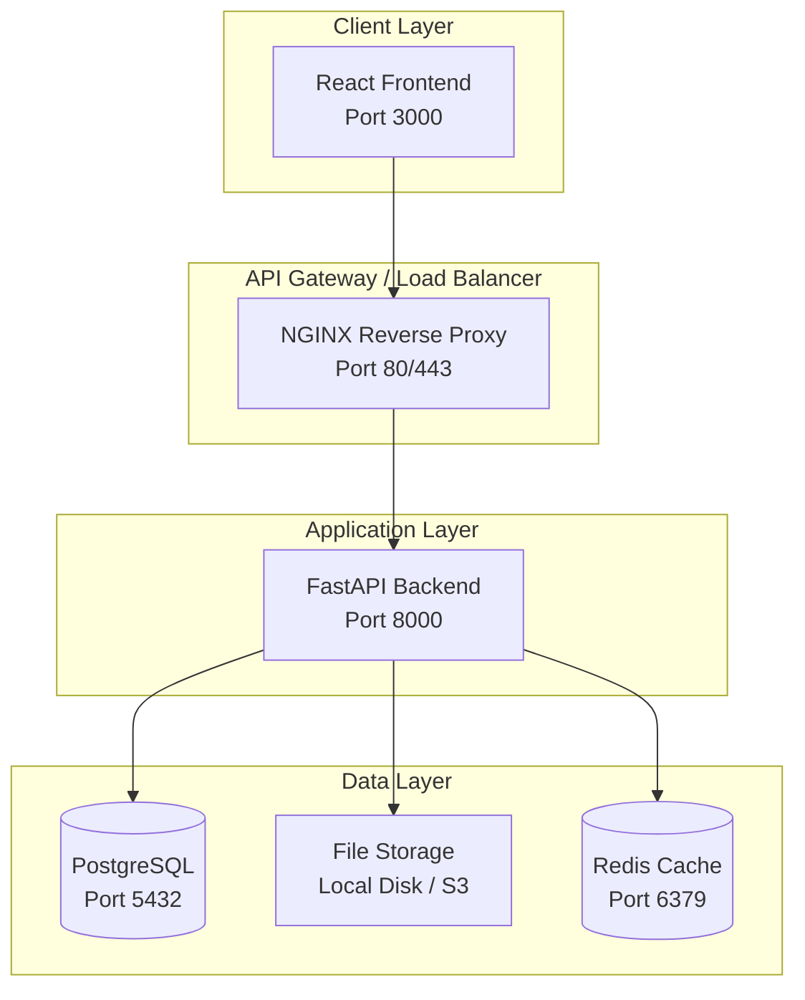
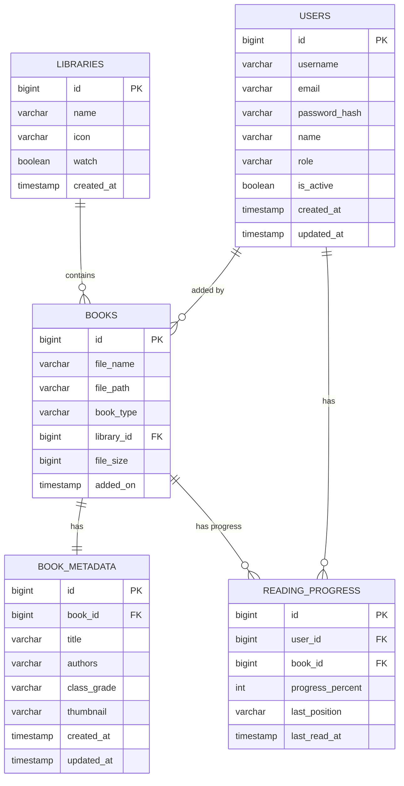
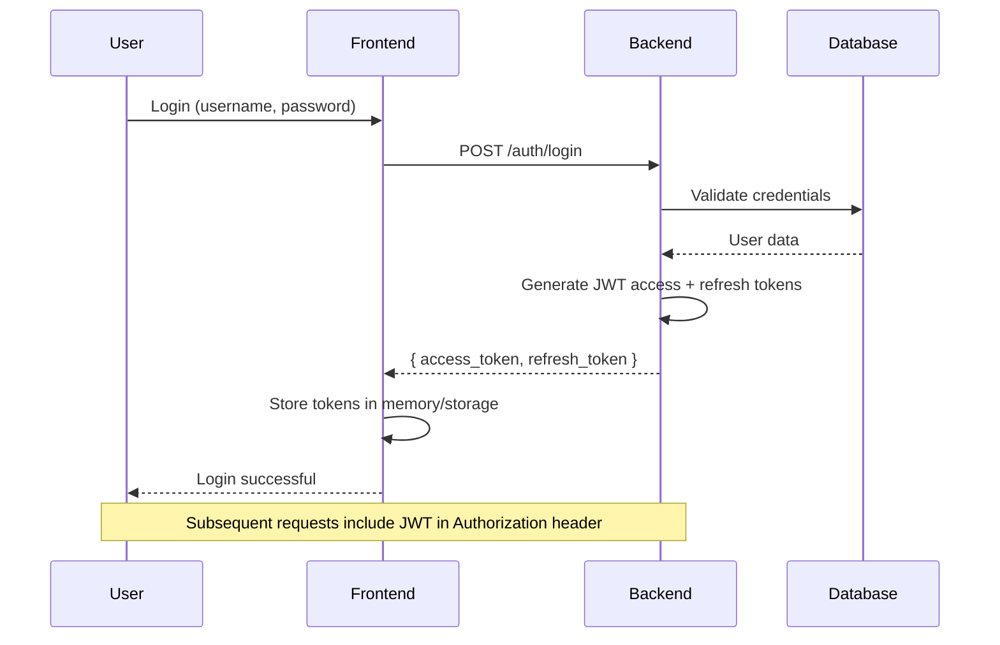
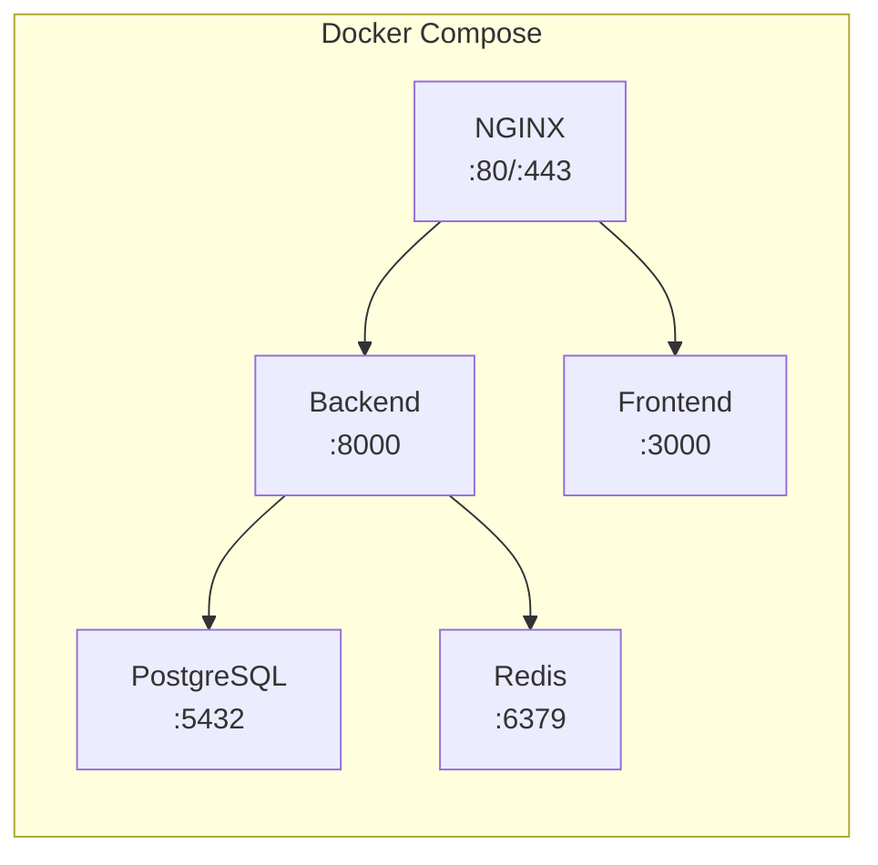

# BookLore - Architecture Document

> **Note**: This is a completely new Digital Library Platform inspired by BookLore, rebuilt from scratch with modern engineering practices.

## Document Status: IN PROGRESS

---

## Table of Contents

1. [High-Level Architecture](#1-high-level-architecture)
2. [Technology Stack](#2-technology-stack)
3. [Backend Architecture](#3-backend-architecture)
4. [Frontend Architecture](#4-frontend-architecture)
5. [Database Design](#5-database-design)
6. [API Design](#6-api-design)
7. [Authentication Flow](#7-authentication-flow)
8. [File Management](#8-file-management)
9. [Reading System](#9-reading-system)
10. [Search Implementation](#10-search-implementation)
11. [User Management](#11-user-management)
12. [Docker Deployment](#12-docker-deployment)
13. [Security Model](#13-security-model)
14. [Performance Considerations](#14-performance-considerations)

---

## 1. High-Level Architecture



## 2. Technology Stack

### Backend
- **Framework**: Python 3.11+ with FastAPI
- **ORM**: SQLAlchemy 2.0 with async support
- **Database**: PostgreSQL 15+
- **Cache**: Redis
- **Auth**: JWT with refresh tokens
- **File Storage**: Local filesystem (extensible to S3)
- **Migration**: Alembic
- **Validation**: Pydantic v2

### Frontend
- **Framework**: React 18+ with TypeScript
- **Build Tool**: Vite
- **Routing**: React Router v6
- **State Management**: Zustand (lightweight) or TanStack Query
- **UI Library**: Tailwind CSS + shadcn/ui
- **HTTP Client**: Axios or Fetch with custom wrapper
- **PDF Viewer**: ngx-extended-pdf-viewer or pdf.js
- **EPUB Viewer**: epub.js

### Infrastructure
- **Container**: Docker + Docker Compose
- **Web Server**: NGINX
- **CI/CD**: GitHub Actions (configurable)
- **Deployment**: VPS with Docker Compose

---

## 3. Backend Architecture

### 3.1 Project Structure

```
backend/
├── app/
│   ├── __init__.py
│   ├── main.py                 # FastAPI application entry
│   ├── config.py               # Configuration management
│   ├── database.py             # Database connection
│   ├── dependencies.py         # Dependency injection
│   │
│   ├── api/
│   │   ├── __init__.py
│   │   ├── v1/
│   │   │   ├── __init__.py
│   │   │   ├── router.py       # Main API router
│   │   │   ├── auth.py         # Authentication endpoints
│   │   │   ├── books.py        # Book management endpoints
│   │   │   ├── users.py        # User management endpoints
│   │   │   ├── metadata.py     # Metadata endpoints
│   │   │   ├── upload.py       # File upload endpoints
│   │   │   └── search.py       # Search endpoints
│   │
│   ├── models/
│   │   ├── __init__.py
│   │   ├── user.py             # User model
│   │   ├── book.py             # Book model
│   │   ├── book_metadata.py    # Book metadata model
│   │   ├── library.py          # Library model
│   │   └── reading_progress.py # Reading progress model
│   │
│   ├── schemas/
│   │   ├── __init__.py
│   │   ├── auth.py             # Pydantic schemas for auth
│   │   ├── book.py             # Pydantic schemas for books
│   │   ├── user.py             # Pydantic schemas for users
│   │   └── common.py           # Common schemas
│   │
│   ├── services/
│   │   ├── __init__.py
│   │   ├── auth_service.py     # Authentication logic
│   │   ├── book_service.py     # Book management logic
│   │   ├── user_service.py     # User management logic
│   │   ├── file_service.py     # File handling logic
│   │   ├── search_service.py   # Search logic
│   │   └── metadata_service.py # Metadata logic
│   │
│   ├── repositories/
│   │   ├── __init__.py
│   │   ├── user_repository.py  # User data access
│   │   ├── book_repository.py  # Book data access
│   │   └── base.py             # Base repository pattern
│   │
│   ├── core/
│   │   ├── __init__.py
│   │   ├── security.py         # JWT, password hashing
│   │   ├── exceptions.py       # Custom exceptions
│   │   └── logging.py          # Logging configuration
│   │
│   └── utils/
│       ├── __init__.py
│       ├── file_utils.py       # File handling utilities
│       └── validators.py       # Input validators
│
├── tests/
│   ├── __init__.py
│   ├── conftest.py             # Pytest fixtures
│   ├── test_auth.py
│   ├── test_books.py
│   └── test_users.py
│
├── alembic/
│   ├── versions/               # Database migrations
│   └── env.py
│
├── requirements.txt
├── Dockerfile
└── docker-compose.yml
```

### 3.2 Module Responsibilities

| Module | Responsibility |
|--------|----------------|
| `api/v1/auth` | Login, register, token refresh, logout |
| `api/v1/books` | CRUD for books, list, get by ID |
| `api/v1/users` | User management (admin only) |
| `api/v1/upload` | File upload handling (admin) |
| `api/v1/search` | Full-text search across books |
| `services/*` | Business logic layer |
| `repositories/*` | Data access layer |
| `core/security` | JWT token handling, password hashing |

---

## 4. Frontend Architecture

### 4.1 Project Structure

```
frontend/
├── src/
│   ├── __init__.py
│   ├── main.tsx                # React entry point
│   ├── App.tsx                 # Root component
│   ├── App.css                 # Global styles
│   │
│   ├── api/
│   │   ├── __init__.py
│   │   ├── client.ts           # Axios instance
│   │   ├── auth.ts             # Auth API calls
│   │   ├── books.ts            # Books API calls
│   │   └── users.ts            # Users API calls
│   │
│   ├── components/
│   │   ├── __init__.py
│   │   ├── common/             # Shared components
│   │   │   ├── Button.tsx
│   │   │   ├── Input.tsx
│   │   │   ├── Modal.tsx
│   │   │   └── Layout.tsx
│   │   ├── auth/               # Auth components
│   │   │   ├── LoginForm.tsx
│   │   │   └── RegisterForm.tsx
│   │   ├── books/              # Book components
│   │   │   ├── BookCard.tsx
│   │   │   ├── BookList.tsx
│   │   │   └── BookDetail.tsx
│   │   └── reader/             # Reader components
│   │       ├── PdfReader.tsx
│   │       └── EpubReader.tsx
│   │
│   ├── pages/
│   │   ├── __init__.py
│   │   ├── Home.tsx
│   │   ├── Login.tsx
│   │   ├── Register.tsx
│   │   ├── Library.tsx
│   │   ├── BookDetail.tsx
│   │   ├── Reader.tsx
│   │   ├── AdminUpload.tsx
│   │   └── Settings.tsx
│   │
│   ├── hooks/
│   │   ├── __init__.py
│   │   ├── useAuth.ts
│   │   ├── useBooks.ts
│   │   └── useToast.ts
│   │
│   ├── stores/
│   │   ├── __init__.py
│   │   ├── authStore.ts        # Auth state (Zustand)
│   │   └── bookStore.ts        # Book state
│   │
│   ├── types/
│   │   ├── __init__.py
│   │   ├── auth.ts
│   │   ├── book.ts
│   │   └── user.ts
│   │
│   └── utils/
│       ├── __init__.py
│       ├── constants.ts
│       └── helpers.ts
│
├── public/
│   └── favicon.ico
│
├── index.html
├── package.json
├── tsconfig.json
├── vite.config.ts
├── tailwind.config.js
└── Dockerfile
```

### 4.2 Routing Structure

```mermaid
graph TB
    "/" --> Home[Home / Library]
    "/login" --> Login[Login Page]
    "/register" --> Register[Register Page]
    "/books/:id" --> BookDetail[Book Detail]
    "/read/:id" --> Reader[Reader View]
    "/admin/upload" --> Upload[Admin Upload]
    "/settings" --> Settings[Settings]

    Login -->|"Not Authenticated"| Login
    Home -->|"Authenticated"| Home
    Upload -->|"Admin Only"| Upload
```

---

## 5. Database Design

### 5.1 Simplified Schema (School Edition)



### 5.2 Database Tables

| Table | Description |
|-------|-------------|
| `users` | User accounts with roles (admin, student) |
| `libraries` | Book collections (e.g., "School Library") |
| `books` | Uploaded book files with metadata |
| `book_metadata` | Simplified metadata (title, authors, classGrade, thumbnail) |
| `reading_progress` | User's reading progress per book |
| `refresh_tokens` | JWT refresh token storage |

---

## 6. API Design

### 6.1 Base URL Structure

```
Base URL: /api/v1
```

### 6.2 Endpoints

| Method | Endpoint | Description | Auth |
|--------|----------|-------------|------|
| POST | `/auth/register` | Register new user | No |
| POST | `/auth/login` | User login | No |
| POST | `/auth/refresh` | Refresh access token | No |
| POST | `/auth/logout` | Logout user | Yes |
| GET | `/users` | List users (admin) | Admin |
| POST | `/users` | Create user (admin) | Admin |
| GET | `/books` | List books | Yes |
| GET | `/books/:id` | Get book details | Yes |
| POST | `/books` | Upload book (admin) | Admin |
| DELETE | `/books/:id` | Delete book (admin) | Admin |
| PUT | `/books/:id/metadata` | Update metadata | Admin |
| GET | `/books/:id/stream` | Stream book file | Yes |
| GET | `/books/search` | Search books | Yes |
| GET | `/progress` | Get reading progress | Yes |
| PUT | `/progress/:bookId` | Update progress | Yes |

---

## 7. Authentication Flow



---

## 8. File Management

- **Upload Location**: Local filesystem `/data/books/`
- **Supported Formats**: PDF, EPUB
- **Max File Size**: 500MB (configurable)
- **File Naming**: UUID-based to prevent collisions
- **Thumbnail Generation**: Server-side for PDF covers

---

## 9. Reading System

- **PDF**: In-browser viewing via pdf.js or ngx-extended-pdf-viewer
- **EPUB**: In-browser viewing via epub.js
- **Progress Tracking**: Save reading position (page/percentage) server-side
- **Resumption**: Users can resume from last position

---

## 10. Search Implementation

- **Method**: PostgreSQL full-text search (GIN indexes)
- **Indexed Fields**: title, authors
- **Filters**: classGrade, book type
- **Performance**: Redis caching for frequent searches

---

## 11. User Management

### Roles
| Role | Permissions |
|------|-------------|
| `admin` | Upload books, manage users, edit metadata |
| `student` | Browse, read, track progress |

### Multi-tenancy
- Each school = separate instance (database isolation)
- Future: Single database with `school_id` tenant column

---

## 12. Docker Deployment



---

## 13. Security Model

- **Password Hashing**: bcrypt with salt
- **JWT**: RS256 algorithm, 15min access / 7d refresh
- **HTTPS**: Enforced in production
- **CORS**: Configured for frontend origin
- **Rate Limiting**: On auth endpoints
- **Input Validation**: Pydantic schemas on all inputs
- **SQL Injection**: Prevented via ORM (SQLAlchemy)

---

## 14. Performance Considerations

- **Database Indexes**: On frequently queried columns
- **Caching**: Redis for session data and frequent queries
- **Async I/O**: FastAPI async endpoints
- **CDN**: Static assets served via CDN (future)
- **Connection Pooling**: Database connection pools

---

## Appendix: Mermaid Diagram Sources

```mermaid
{{diagram_source}}
```

---

*Document Version: 1.0*
*Last Updated: 2026-06-28*
*Status: IN PROGRESS - Awaiting detailed backend/frontend analysis from reference repo*