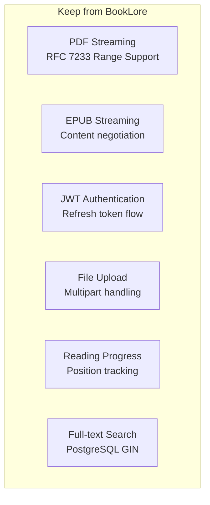

# BookLore - Requirement Mapping & Changes

> Comparing BookLore features with new school library requirements

## 1. Feature Comparison Matrix

| BookLore Feature | Keep | Redesign | Remove | New Requirement | Implementation |
|-----------------|------|----------|--------|-----------------|----------------|
| **PDF Reading** | ✅ | | | In-browser PDF viewer | Keep - pdf.js |
| **EPUB Reading** | ✅ | | | In-browser EPUB viewer | Keep - epub.js |
| **Book Upload** | | ✅ | | Simplified to title/author/classGrade only | Redesign BookDrop |
| **Multi-user Login** | ✅ | | | Students + Admin roles | Keep - JWT auth |
| **Search by Title** | ✅ | | | Full-text search | Keep - PostgreSQL GIN |
| **Search by Author** | ✅ | | | Full-text search | Keep |
| **Library Browsing** | ✅ | | | Grid view of books | Keep |
| **Reading Progress** | ✅ | | | Track page/position | Keep |
| **User Management** | ✅ | | | Admin creates/manages students | Keep |
| **Metadata Editor** | | ✅ | | Only title/author/classGrade | Redesign |
| **Google Books API** | | | ❌ | Not needed for Indian books | Remove |
| **Amazon Scraping** | | | ❌ | Unreliable, blocked | Remove |
| **Goodreads Scraping** | | | ❌ | Not needed | Remove |
| **Hardcover API** | | | ❌ | Not needed | Remove |
| **Open Library API** | | | ❌ | Not needed | Remove |
| **ISBN Fields** | | | ❌ | Replace with classGrade | Remove |
| **Rating Fields** | | | ❌ | Not needed for school | Remove |
| **Review System** | | | ❌ | Not needed | Remove |
| **Series Fields** | | | ❌ | Not needed | Remove |
| **Field Locking** | | | ❌ | Only needed with auto-fetch | Remove |
| **OPDS Catalog** | | | ❌ | Not needed for school | Remove |
| **Kobo Sync** | | | ❌ | No Kobo devices in school | Remove |
| **KOReader Sync** | | | ❌ | Not relevant | Remove |
| **Email/Kindle Sharing** | | | ❌ | Not needed | Remove |
| **Magic Shelves** | | | ❌ | Too complex for staff | Remove |
| **Reading Statistics** | | | ❌ | Not needed | Remove |
| **Dashboard Charts** | | | ❌ | Not needed | Remove |
| **Metadata Backup/Restore** | | | ❌ | Only needed with auto-fetch | Remove |
| **Comic CBX Reader** | | | ❌ | School uses PDF/EPUB only | Remove |
| **Author Browser** | | | ❌ | Simplified - just author text field | Remove |
| **Category/Mood/Tag** | | | ❌ | Not needed | Remove |
| **Physical Book Support** | | | ❌ | Digital only | Remove |
| **Audiobook Support** | | | ❌ | Not in scope | Remove |
| **OIDC Authentication** | | | ❌ | Simple local auth | Remove |
| **WebSocket Real-time** | | | ❌ | Not needed for MVP | Remove |
| **Multi-library Support** | | ✅ | | Single library per school | Simplify |
| **BookShelf Custom Shelves** | | | ❌ | Not needed | Remove |
| **Bookdrop Periodic Scan** | | | ❌ | Manual upload only | Remove |

---

## 2. New Features Required

### 2.1 ClassGrade Classification (NEW)

| Aspect | Details |
|--------|---------|
| **Field Name** | `classGrade` |
| **Type** | VARCHAR(20) |
| **Values** | `General`, `Class 1`, `Class 2`, ... `Class 12` |
| **Purpose** | Classify books by school grade level |
| **UI** | Dropdown selector when uploading/editing |

**Database Addition:**
```sql
ALTER TABLE book_metadata ADD COLUMN class_grade VARCHAR(20);
```

### 2.2 Simplified Metadata Model

| Field | Type | Required | Description |
|-------|------|----------|-------------|
| `id` | BIGINT | PK | Auto-increment |
| `book_id` | BIGINT | FK | Reference to books table |
| `title` | VARCHAR(500) | Yes | Book name |
| `authors` | VARCHAR(500) | Yes | Author name(s) |
| `class_grade` | VARCHAR(20) | Yes | Class 1-12 or General |
| `thumbnail` | VARCHAR(1000) | No | Cover image path |
| `created_at` | TIMESTAMP | Auto | Creation time |
| `updated_at` | TIMESTAMP | Auto | Last update time |

**Removed Fields** (from BookLore's book_metadata):
- subtitle, description, publisher, published_date
- isbn_10, isbn_13, asin
- page_count, language
- All rating fields (amazon, goodreads, hardcover, personal)
- All series fields (series_name, series_number, series_total)
- All locked boolean fields (title_locked, author_locked, etc.)
- categories, moods, tags

### 2.3 Role-Based Access Control

| Role | Permissions |
|------|-------------|
| `admin` | Upload books, Edit metadata, Manage users, Delete books, View all |
| `student` | Browse library, Read books, Track progress, View profile |

---

## 3. Changes to BookLore Patterns

### 3.1 Backend Changes

| BookLore Pattern | New Implementation |
|-----------------|-------------------|
| Java Spring Boot | Python FastAPI |
| JPA/Hibernate | SQLAlchemy 2.0 (async) |
| MariaDB | PostgreSQL |
| 47 Controllers | ~8 Controllers (simplified) |
| 100+ Services | ~10 Services (simplified) |
| 133+ DB Migrations | ~15 Migrations (simplified) |
| Complex entity models (50+ fields) | Simple models (6 fields) |
| JWT with HS256 | JWT with HS256 (same algorithm) |
| 10-hour access token | 15-minute access token |
| 30-day refresh token | 7-day refresh token |
| WebSocket real-time updates | HTTP polling (MVP) |
| Multi-library support | Single library |

### 3.2 Frontend Changes

| BookLore Pattern | New Implementation |
|-----------------|-------------------|
| Angular 21 | React 18 + TypeScript |
| PrimeNG components | Tailwind + shadcn/ui |
| Complex state (BehaviorSubjects) | Zustand (simple state) |
| Lazy-loaded routes | React Router v6 |
| WebSocket for updates | React Query for data fetching |
| 40+ feature components | ~15 core components |
| Metadata editor (20+ fields) | Simple form (3 fields + classGrade) |
| Bookdrop with auto-fetch | Simple file upload |
| OPDS/Kobo/KOReader settings | Removed |
| Stats dashboard | Removed |
| Series/Author browsers | Simple text search |

### 3.3 API Changes

| BookLore Endpoint Pattern | New Simplified Pattern |
|--------------------------|----------------------|
| `GET /api/v1/books` | `GET /api/v1/books` (simplified response) |
| `POST /api/v1/books` | `POST /api/v1/books` (multipart upload) |
| `GET /api/v1/metadata/fetch` | **REMOVED** |
| `GET /api/v1/opds/**` | **REMOVED** |
| `GET /api/v1/kobo/**` | **REMOVED** |
| `POST /api/v1/auth/register` | `POST /api/v1/auth/register` (admin only) |
| Custom OPDS XML feeds | Standard REST JSON |

---

## 4. What We Keep from BookLore

### 4.1 Core Functionality (Keep As-Is)



### 4.2 Design Patterns We Keep

| Pattern | Description |
|---------|-------------|
| Repository Pattern | Data access abstraction |
| Service Layer | Business logic separation |
| Dependency Injection | Clean module dependencies |
| RESTful API Design | Resource-based endpoints |
| JWT Bearer Token | Stateless authentication |
| File Streaming | HTTP Range header support |
| Pagination | Offset-based pagination |

### 4.3 Code Patterns We Keep

```python
# Service Layer Pattern
class BookService:
    def __init__(self, repository: BookRepository):
        self._repository = repository

    def get_book(self, book_id: int) -> Book | None:
        return self._repository.find_by_id(book_id)

# Repository Pattern
class BookRepository:
    def __init__(self, db: AsyncSession):
        self._db = db

    async def find_by_id(self, book_id: int) -> Book | None:
        result = await self._db.execute(
            select(Book).where(Book.id == book_id)
        )
        return result.scalar_one_or_none()
```

---

## 5. Technical Impact Summary

### 5.1 Complexity Reduction

| Metric | BookLore | New System | Reduction |
|--------|----------|------------|-----------|
| Java Files | ~1028 | 0 (Python) | 100% |
| TypeScript Files | ~406 | ~80 | 80% |
| Database Tables | 50+ | 6 | 88% |
| API Endpoints | 200+ | ~25 | 87% |
| Migration Files | 133+ | ~15 | 89% |
| Feature Components | 40+ | ~15 | 62% |

### 5.2 New Technology Choices

| Category | Choice | Reason |
|----------|--------|--------|
| Backend | FastAPI | Modern, async, great docs |
| ORM | SQLAlchemy 2.0 | Async support, type-safe |
| Database | PostgreSQL | Better scaling than MariaDB |
| Frontend | React 18 | Popular, large ecosystem |
| Build | Vite | Fast builds, HMR |
| State | Zustand | Simple, minimal boilerplate |
| UI | Tailwind + shadcn | Modern, accessible components |
| Auth | python-jose + passlib | Complete JWT solution |

### 5.3 Multi-Tenancy Strategy

For 100 schools with 20,000 users each:

**Option A: Separate Databases (Recommended for MVP)**
- Each school gets own PostgreSQL database
- Simple isolation
- Easy backup/restore per school
- Scales to ~100 schools

**Option B: Single Database with tenant_id**
- All schools share database
- Add `school_id` column to all tables
- More complex queries
- Scales to unlimited schools

**Decision**: Start with Option A (separate databases) for simplicity, migrate to Option B if needed.

---

## 6. Out of Scope (Explicitly Not Building)

These BookLore features are explicitly excluded:

- ❌ Metadata providers (Google, Amazon, Goodreads, Hardcover)
- ❌ ISBN/ASIN/ratings/reviews
- ❌ OPDS feed generation
- ❌ Kobo device synchronization
- ❌ KOReader synchronization
- ❌ Email/Kindle book sending
- ❌ Magic/rule-based shelves
- ❌ Reading statistics and charts
- ❌ Comic book (CBX/CBR) reader
- ❌ Audiobook support
- ❌ Physical book tracking
- ❌ OIDC/OAuth2 integration
- ❌ WebSocket real-time updates
- ❌ Multi-library support
- ❌ Custom shelves
- ❌ Book recommendations
- ❌ Author/Series browsers
- ❌ Annotation and notes
- ❌ Bookmarks
- ❌ Metadata backup/restore

---

*Document Version: 1.0*
*Status: COMPLETED*
*Last Updated: 2026-06-28*