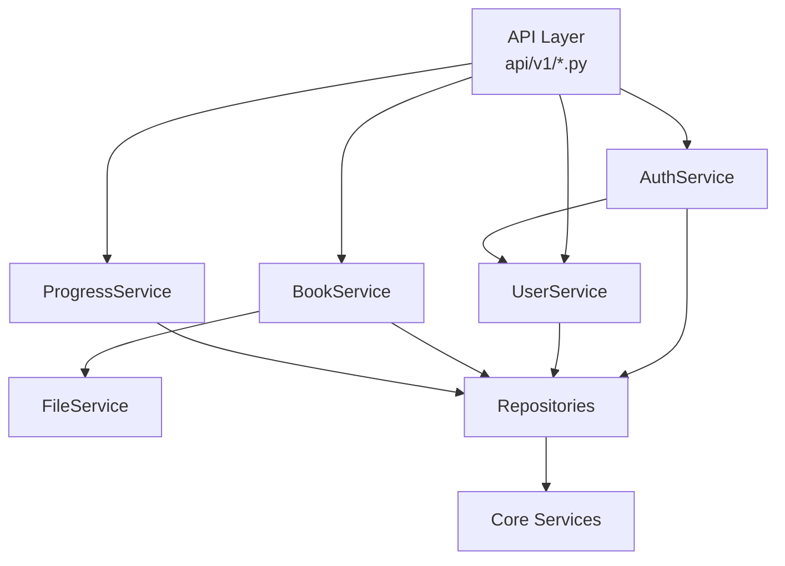
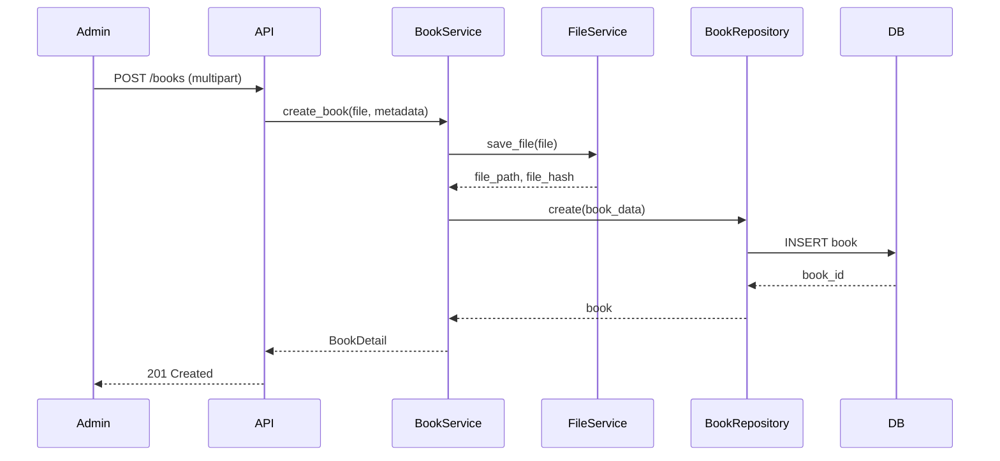
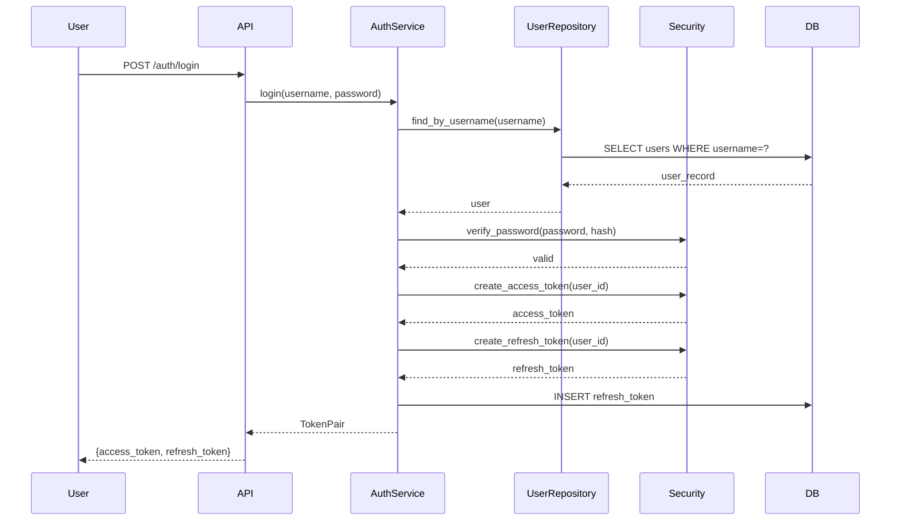

# BookLore - Module Design

## Overview

Backend module architecture following Clean Architecture principles.

---

## Module Structure

```
backend/
├── app/
│   ├── api/                    # API Layer (Controllers)
│   │   └── v1/
│   │       ├── router.py       # Main router aggregator
│   │       ├── auth.py         # Authentication endpoints
│   │       ├── users.py        # User management endpoints
│   │       ├── books.py        # Book endpoints
│   │       ├── progress.py     # Reading progress endpoints
│   │       └── health.py       # Health check
│   │
│   ├── services/               # Business Logic Layer
│   │   ├── auth_service.py
│   │   ├── user_service.py
│   │   ├── book_service.py
│   │   ├── file_service.py
│   │   └── progress_service.py
│   │
│   ├── repositories/           # Data Access Layer
│   │   ├── base.py
│   │   ├── user_repository.py
│   │   ├── book_repository.py
│   │   └── progress_repository.py
│   │
│   ├── models/                 # SQLAlchemy Models
│   │   ├── base.py
│   │   ├── user.py
│   │   ├── book.py
│   │   ├── book_metadata.py
│   │   ├── reading_progress.py
│   │   ├── refresh_token.py
│   │   └── audit_log.py
│   │
│   ├── schemas/                # Pydantic Schemas
│   │   ├── base.py
│   │   ├── auth.py
│   │   ├── user.py
│   │   ├── book.py
│   │   └── progress.py
│   │
│   ├── core/                   # Core Utilities
│   │   ├── config.py           # Configuration
│   │   ├── security.py         # JWT, password hashing
│   │   ├── exceptions.py       # Custom exceptions
│   │   └── logging.py          # Logging setup
│   │
│   └── main.py                 # FastAPI application
```

---

## Module Responsibilities

### 1. Authentication Module (`auth`)

**Purpose**: Handle user authentication and token management

**Files**:
- `api/v1/auth.py` - Auth endpoints
- `services/auth_service.py` - Auth business logic
- `repositories/user_repository.py` - User data access
- `schemas/auth.py` - Auth request/response schemas
- `core/security.py` - JWT and password utilities

**Public API**:
```python
class AuthService:
    def login(self, username: str, password: str) -> TokenPair
    def register(self, user_data: UserCreate) -> User
    def refresh_token(self, refresh_token: str) -> AccessToken
    def logout(self, refresh_token: str) -> None
    def verify_password(self, plain: str, hashed: str) -> bool
    def hash_password(self, password: str) -> str
```

**Database Tables**: `users`, `refresh_tokens`

---

### 2. User Module (`users`)

**Purpose**: Manage user accounts and permissions

**Files**:
- `api/v1/users.py` - User endpoints
- `services/user_service.py` - User business logic
- `schemas/user.py` - User schemas

**Public API**:
```python
class UserService:
    def list_users(self, page: int, limit: int, role: str) -> PaginatedUsers
    def get_user(self, user_id: int) -> User
    def create_user(self, user_data: UserCreate) -> User
    def update_user(self, user_id: int, data: UserUpdate) -> User
    def delete_user(self, user_id: int) -> None
```

**Database Tables**: `users`

**Permissions**:
- List users: Admin only
- Get user: Admin or self
- Create user: Admin only
- Update user: Admin only
- Delete user: Admin only (not self)

---

### 3. Book Module (`books`)

**Purpose**: Manage books and metadata

**Files**:
- `api/v1/books.py` - Book endpoints
- `services/book_service.py` - Book business logic
- `services/file_service.py` - File handling
- `repositories/book_repository.py` - Book data access
- `schemas/book.py` - Book schemas

**Public API**:
```python
class BookService:
    def list_books(
        self,
        page: int,
        limit: int,
        class_grade: str,
        book_type: str,
        search: str
    ) -> PaginatedBooks

    def get_book(self, book_id: int) -> BookDetail
    def create_book(self, file, metadata: BookCreate) -> BookDetail
    def update_book(self, book_id: int, data: BookUpdate) -> BookDetail
    def delete_book(self, book_id: int) -> None
    def stream_book(self, book_id: int, range_header: str) -> StreamingResponse
    def upload_cover(self, book_id: int, file) -> str
```

**Database Tables**: `books`, `book_metadata`

**Permissions**:
- List books: All authenticated
- Get book: All authenticated
- Create book: Admin only
- Update book: Admin only
- Delete book: Admin only
- Stream book: All authenticated
- Upload cover: Admin only

---

### 4. Progress Module (`progress`)

**Purpose**: Track user's reading progress

**Files**:
- `api/v1/progress.py` - Progress endpoints
- `services/progress_service.py` - Progress business logic
- `repositories/progress_repository.py` - Progress data access
- `schemas/progress.py` - Progress schemas

**Public API**:
```python
class ProgressService:
    def get_all_progress(self, user_id: int) -> List[Progress>
    def get_progress(self, user_id: int, book_id: int) -> Progress | None
    def update_progress(
        self,
        user_id: int,
        book_id: int,
        percent: int,
        position: str
    ) -> Progress
```

**Database Tables**: `reading_progress`

**Permissions**:
- Get all progress: Own user only
- Get progress: Own user only
- Update progress: Own user only

---

### 5. Health Module (`health`)

**Purpose**: Application health checks

**Files**:
- `api/v1/health.py` - Health endpoints

**Public API**:
```python
GET /health  # Returns {"status": "healthy", "timestamp": "..."}
```

**Permissions**: Public (no auth required)

---

## Service Dependencies



---

## Data Flow

### Book Upload Flow



### Authentication Flow



---

## Error Handling

Each module throws domain-specific exceptions:

```python
# core/exceptions.py
class BookLoreException(Exception):
    def __init__(self, code: str, message: str, status_code: int = 400):
        self.code = code
        self.message = message
        self.status_code = status_code

class UnauthorizedException(BookLoreException):
    def __init__(self, message: str = "Unauthorized"):
        super().__init__("UNAUTHORIZED", message, 401)

class ForbiddenException(BookLoreException):
    def __init__(self, message: str = "Forbidden"):
        super().__init__("FORBIDDEN", message, 403)

class NotFoundException(BookLoreException):
    def __init__(self, resource: str):
        super().__init__("NOT_FOUND", f"{resource} not found", 404)

class ValidationException(BookLoreException):
    def __init__(self, message: str):
        super().__init__("VALIDATION_ERROR", message, 400)
```

---

## Testing Strategy

### Unit Tests
- Each service tested in isolation with mocked repositories
- Core security functions tested directly

### Integration Tests
- API endpoints tested with test database
- Repository methods tested with real DB

### Test Structure
```
tests/
├── conftest.py           # Pytest fixtures
├── test_auth.py
├── test_users.py
├── test_books.py
└── test_progress.py
```

---

*Document Version: 1.0*
*Status: COMPLETED*
*Last Updated: 2026-06-28*